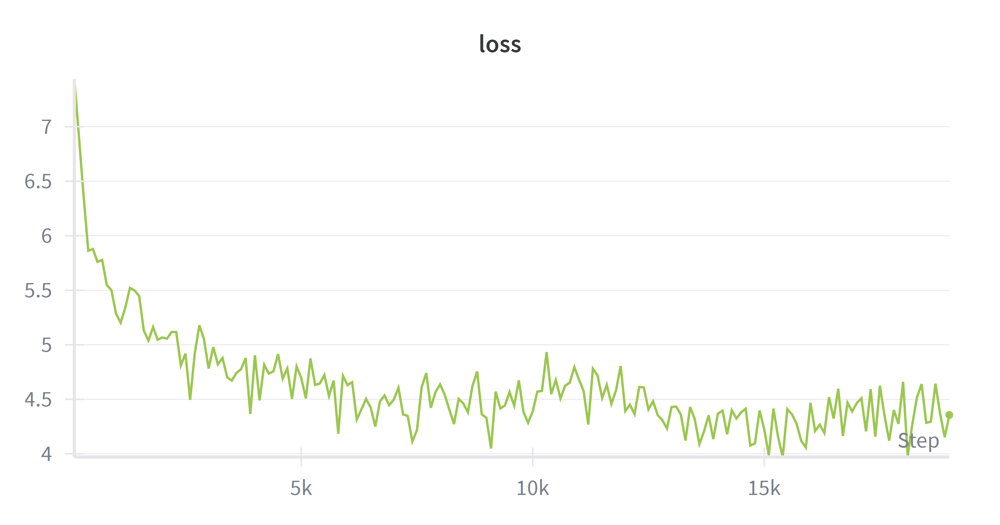
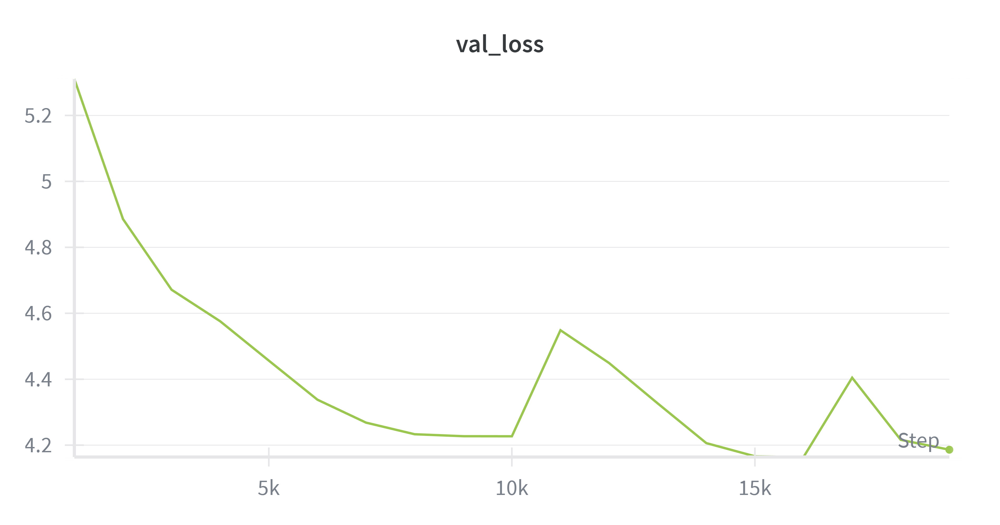
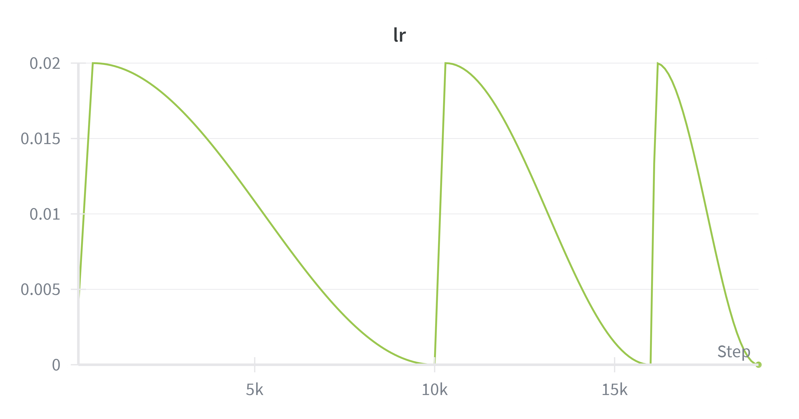

# SLMS - Small Language Models Framework

## 📖 The Story & Vision

### Origins

This project began with a question: *Can we create highly efficient, specialized language models that run natively on edge devices without sacrificing deep reasoning capabilities?* The goal was to bridge the gap between heavy cloud-based LLMs and the restricted computational power of mobile hardware.

### The Multilingual Experiment

Initially, the project aimed for a massive scope. I attempted to train a multilingual foundation model covering **English, Turkish, Russian, French, German, and Chinese**.

* **The Complexity of Chinese:** During the early iterations, I discovered that the token density and structural complexity of Chinese required a significantly larger vocabulary and deeper embedding space than my target architecture allowed.
* **The Budget Constraint:** Training a high-quality multilingual model requires immense computational resources. As an independent developer, I had to make strategic decisions to maximize the "intelligence-per-dollar" ratio. To ensure the model reached a high level of reasoning (GSM8K standards) within a realistic budget, I narrowed the focus exclusively to English.

### Why Spiking Neural Networks (SNN)?

Beyond standard Transformers, I integrated SNN architectures to explore biological efficiency. SNNs process information through discrete pulses (spikes), potentially offering a path to "always-on" AI with a fraction of the power consumption of traditional dense models.

---

## 🌟 Key Features

* **Hybrid Engine**: Toggle between **Regular Transformer** (for stability) and **SNN** (for efficiency).
* **Strategic Curriculum**: A three-phase training approach (256 → 1024 → 2048) to stabilize long-context learning.
* **Edge-First Design**: Native CoreML export support for high-speed inference on Apple Neural Engine (ANE).
* **Advanced Optimization**: Utilizing the **Muon Optimizer** for 2D parameters to achieve faster convergence during pre-training.

---

## 🏗️ Architecture Deep Dive

### Regular Transformer

* **Attention**: Grouped Query Attention (GQA) with Sliding Window mechanisms.

* **Normalization**: Pre-RMSNorm for improved gradient stability.
* **Memory Efficiency**: Gradient Checkpointing integrated into every block to allow training 1B+ models on consumer GPUs.

### Spiking Neural Network

* **Neuronal Model**: Leaky Integrate-and-Fire (LIF) neurons from `snntorch`.
* **Temporal Processing**: Multi-step spike integration to capture sequential dependencies without the quadratic cost of full attention.

---

## 📈 Training Methodology & Progress

### Training Pipeline

The training followed a **two-stage approach** combining pre-training and knowledge distillation:

#### Stage 1: Foundation Pre-training

The model was trained through a strategic curriculum across three phases:

| Phase | Objective | Context | Dataset | Status |
| --- | --- | --- | --- | --- |
| **Phase 1** | Language Foundations | 256 | [phase1-256](https://huggingface.co/datasets/Chan-Y/phase1-256) | Completed (100k steps) |
| **Phase 2** | Reasoning & Logic | 1,024 | [phase2-1024](https://huggingface.co/datasets/Chan-Y/phase2-1024) | Completed |
| **Phase 3** | Long Context | 2,048 | [phase3-2048](https://huggingface.co/datasets/ChanY2/phase3-2048) | Completed |

**Result**: The Flow model achieved **4.1 perplexity** after the initial pre-training phase, demonstrating strong language modeling capabilities.

#### Stage 2: Knowledge Distillation from Qwen3-4B

To enhance mathematical reasoning without extensive compute requirements, I employed **knowledge distillation**:

1. **Teacher Model**: Used **[Qwen3-4B-Instruct-2507](https://huggingface.co/Qwen/Qwen3-4B-Instruct-2507)** (4B parameters) as the teacher
2. **Data Generation**: Generated solutions to **GSM8K** math problems using the teacher model
3. **Distillation Training**: Fine-tuned the Flow-1B and Pulse-1B models on the teacher's reasoning traces

This approach allowed the 1B parameter student models to "learn" from a larger, more capable teacher without requiring the computational budget to train on raw data alone.

### Training Metrics (Flow Model)

Below are the training curves from Weights & Biases for the Flow-1B model during pre-training:

<p align="center">
  
  
</p>

<p align="center">
  
</p>

**Key Observations:**
- **Training Loss**: Steady convergence from ~7.0 to ~4.3 over 20k steps
- **Validation Loss**: Final validation loss of **~4.1** (corresponding to 4.1 perplexity)
- **Learning Rate**: Cosine annealing schedule with warm restarts to prevent local minima

---

## � Budget & Infrastructure

This project was built with **extreme resource constraints** in mind:

* **Total Budget**: Approximately **$50 USD** for all training phases
* **GPU Provider**: [vast.ai](https://vast.ai) - rented affordable GPU instances (primarily RTX 3090/4090 on the spot market)
* **Training Duration**: Due to the limited budget, training was kept minimal with carefully selected checkpoints rather than exhaustive long runs
* **Strategic Choices**: Every decision—from curriculum design to architecture choices—was optimized for maximum "intelligence per dollar"

This constraint forced innovation: using gradient checkpointing, mixed precision, and the Muon optimizer allowed me to achieve respectable reasoning capabilities on a shoestring budget that would typically be unrealistic for LLM training.

---

## 🤗 Trained Models & Datasets

All trained models and datasets are publicly available on Hugging Face:

### Pre-trained Models

* **[Flow-1B-gsm8k](https://huggingface.co/Chan-Y/Flow-1B-gsm8k)** - Regular Transformer model fine-tuned on GSM8K reasoning tasks
* **[Pulse-1B-gsm8k](https://huggingface.co/Chan-Y/Pulse-1B-gsm8k)** - Spiking Neural Network (SNN) variant trained on GSM8K

### Custom Tokenizer

* **[custom_tokenizer-1024](https://huggingface.co/Chan-Y/custom_tokenizer-1024)** - BPE tokenizer with 1,024 tokens, optimized for English

### Training Datasets

* **[phase1-256](https://huggingface.co/datasets/Chan-Y/phase1-256)** - Foundational language training (256 context length)
* **[phase2-1024](https://huggingface.co/datasets/Chan-Y/phase2-1024)** - Reasoning and logic training (1,024 context length)
* **[phase3-2048](https://huggingface.co/datasets/ChanY2/phase3-2048)** - Long-context polish training (2,048 context length)

---

## �📂 Project Structure

```text
.
├── data/               # Cleaning, Tokenization, and HF Upload scripts
├── models/             # Transformer & SNN implementations
├── tokenizer/          # Custom BPE Tokenizer training
├── config.yaml         # Centralized training & model configuration
├── multigpu_train.py   # Distributed training entry point
└── convert.py          # CoreML / Edge deployment utility

```

---

## 🚀 How to Use

1. **Configure**: Update `config.yaml` with your HuggingFace tokens and local paths.
2. **Setup**: Run `accelerate config` to map your local GPUs.
3. **Train**: Start the curriculum with `accelerate launch multigpu_train.py`.

## 📚 References & Mathematical Foundations

This framework is built upon the synthesis of several state-of-the-art research papers and architectures. The implementation of specific modules (Attention, RoPE, SNN) is informed by the following literature:

### Core Transformer Architectures

* **Llama Series (Meta AI)**: Implementation of **Rotary Positional Embeddings (RoPE)** and the use of **RMSNorm** for pre-normalization stability.
  * [The Llama 3 Herd of Models](https://arxiv.org/abs/2407.21783)
  * [The Llama 4 Herd](https://ai.meta.com/blog/llama-4-multimodal-intelligence/)
* **Gemma 2 & 3 (Google DeepMind)**: Inspiration for the **Sliding Window Attention** mechanism and the integration of local/global attention layers.
  * [Gemma 2: Improving Open Language Models at a Practical Size](https://arxiv.org/abs/2408.00118)
  * [Gemma 3 Technical Report](https://arxiv.org/abs/2503.19786)
* **Qwen 2 & 3 (Alibaba Cloud)**: Insights into high-token-density training and architectural scaling for small-parameter models (SLMs).
  * [Qwen2 Technical Report](https://arxiv.org/abs/2407.10671)
  * [Qwen3 Technical Report](https://arxiv.org/abs/2505.09388)

### Spiking Neural Networks (SNN)

* **snntorch (Luo & Eshraghian)**: The fundamental library used for spiking neuron dynamics and surrogate gradient learning.
* **SpikeGPT**: Generative Pre-trained Language Model with Spiking Neural Networks
  * [SpikeGPT Paper](https://arxiv.org/abs/2302.13939)
* **SpikeLLM**: Scaling up Spiking Neural Network to Large Language Models via Saliency-based Spiking
  * [SpikeLLM Paper](https://arxiv.org/abs/2407.04752)
* **Attention Spiking Neural Networks**: Advanced attention mechanisms for spiking architectures
  * [Attention Spiking Neural Networks](https://arxiv.org/abs/2209.13929)

### Optimization & Scaling

* **Muon Optimizer (Kellin Pelrine et al.)**: Implementation of the **Matrix-valued Orthogonalized Newton (Muon)** optimizer for faster convergence on 2D weight matrices during the pre-training phase.
  * [Muon is Scalable for LLM Training](https://arxiv.org/abs/2502.16982)
* **Chinchilla Scaling Laws (Hoffmann et al.)**: Used to determine the optimal balance between parameter count (1B) and dataset size (30GB) for maximum efficiency.

---

## 🛠️ Technical Implementation Notes

* **Weight Tying**: To reduce memory footprint and improve convergence, the model uses tied weights between the `token_embedding` and the `lm_head`.
* **Mixed Precision (BF16)**: All training is conducted in `bfloat16` to leverage the hardware acceleration of RTX 40-series Tensor Cores while maintaining numerical stability.
* **Gradient Checkpointing**: Strategically applied to Transformer blocks to enable training with sequence lengths up to 2,048 on 16GB/32GB VRAM hardware.